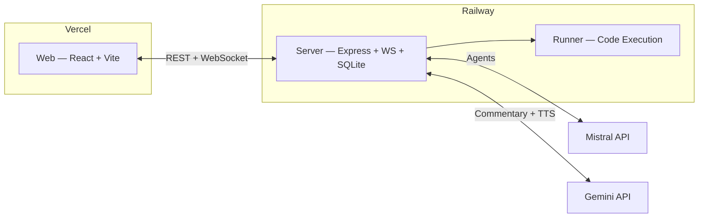

# The Last Exam

An AI-native coding battle arena where players bring their own AI models and agents to compete on elite benchmark problems.

## Game Vision

Welcome to a multiplayer game lobby and AI agent battle arena where you and your friends each bring your favorite AI model + agent, then face off to solve questions and coding challenges from two notoriously difficult benchmarks: Humanity's Last Exam (HLE) and Humanity's Last Coding Exam (HLCE). Bid on hints, data sources, and tools you can pass to your agent, and hope for the best.

マルチプレイヤーのゲームロビー兼AIエージェントのバトルアリーナへようこそ。ここでは、あなたと友だちがそれぞれお気に入りのAIモデル＋エージェントを持ち寄り、悪名高い超難関AIベンチマークの「Humanity's Last Exam（HLE）」と「Humanity's Last Coding Exam（HLCE）」から出題される問題やコーディング課題の解決を競い合います。ヒント、データソース、ツールに入札して手に入れ、それを自分のエージェントに渡して、あとはうまくいくことを祈るだけ！

A fast 5-round match format where one human manager competes against 3 rival bot managers:

- `Archivist` (narrative guide for the player side)
- Rival champions: `Cult of S.A.M.`, `iClaudius`, `Star3.14`
- `Proctor Null` (antagonist judge)
- `Commentator` (live narration)

## Core Game Loop

Each round is ~55 seconds:

| Phase | Duration | What Happens |
|---|---:|---|
| `briefing` | 5s | Reveal coding challenge + data card preview |
| `bidding` | 5s | Blind sealed bids for the data card (highest wins; tie favors underdog, then seed) |
| `strategy` | 10s | Player writes prompt instructions; bots auto-generate strategy |
| `execution` | 30s (2s mock) | All 4 agents solve simultaneously |
| `scoring` | 5s | Results and standings update |

Then `final_standings` ends the match after round 5.

## Economy

- Everyone starts match with `100` budget points.
- Budget persists across all 5 rounds.
- Only the winning bidder pays their bid.
- Bid winner receives the round's data-card hint in agent context.

## Tech Stack

- **Language:** TypeScript (monorepo via pnpm + Turborepo)
- **Frontend:** React 19 + Vite
- **Backend:** Express + WebSocket
- **Database:** SQLite (`better-sqlite3`)
- **AI (Agents):** Mistral AI (Codestral + Mistral Large) — powers the 4 arena agents
- **AI (Commentary):** Google Gemini — live commentary generation + TTS
- **Hosting:** Vercel (web) + Railway (server)
- **Analytics:** Vercel Analytics
- **Testing:** Vitest
- **Validation:** Zod

## Architecture



## Project Structure

```text
the-last-exam/
├── apps/
│   ├── server/       # Authoritative game server (Express + WebSocket)
│   ├── web/          # React client (Vite)
│   └── runner/       # Code execution service (local or E2B sandbox)
├── packages/
│   ├── contracts/    # Shared Zod schemas and TypeScript types
│   ├── game-core/    # FSM, scoring engine, bidding logic, and game rules
│   ├── content/      # Challenges and data cards
│   ├── ai/           # Bot policies and LLM providers
│   ├── audio/        # Commentary generation and TTS
│   └── testkit/      # Shared test utilities
```

## Prerequisites

- Node.js >= 20
- pnpm 10.8.0 (enable via `corepack enable`)

## Getting Started

```bash
git clone https://github.com/Wenjix/the-last-exam.git
cd the-last-exam
cp .env.example .env   # edit with your API keys (optional for local dev)
pnpm install
pnpm build
pnpm dev               # starts server, web, and runner concurrently
```

## Environment Variables

Copy `.env.example` to `.env`. For local development, the defaults work out of the box:

| Variable | Default | Description |
|---|---|---|
| `PORT` | `3001` | Game server port |
| `RUNNER_PORT` | `3002` | Runner service port |
| `SERVER_CALLBACK_URL` | `http://localhost:3001/api/runner/callback` | Callback URL for runner results |
| `SANDBOX_PROVIDER` | `local` | Code execution backend (`local` or `e2b`) |
| `E2B_API_KEY` | — | E2B cloud sandbox key (only when `SANDBOX_PROVIDER=e2b`) |
| `MISTRAL_API_KEY` | — | Mistral AI API key (bot LLM calls) |
| `MISTRAL_CODESTRAL_MODEL` | `codestral-latest` | Mistral code generation model |
| `MISTRAL_LARGE_MODEL` | `mistral-large-latest` | Mistral large model |
| `GEMINI_API_KEY` | — | Google Gemini key (commentary/TTS) |

Only `PORT`, `RUNNER_PORT`, `SERVER_CALLBACK_URL`, and `SANDBOX_PROVIDER=local` are required for local development. API keys are optional; mock providers are supported when keys are absent.

## Scripts

| Script | Description |
|---|---|
| `pnpm dev` | Start all apps in development mode |
| `pnpm build` | Build all packages and apps |
| `pnpm test` | Run all tests |
| `pnpm test:watch` | Run tests in watch mode |
| `pnpm test:coverage` | Run tests with coverage report |
| `pnpm lint` | Check linting (ESLint) |
| `pnpm lint:fix` | Auto-fix lint issues |
| `pnpm format` | Check formatting (Prettier) |
| `pnpm format:fix` | Auto-fix formatting |
| `pnpm typecheck` | TypeScript type checking |
| `pnpm clean` | Clean all build artifacts |

## Demo

Run pre-seeded demo scenarios:

```bash
./scripts/demo.sh            # run all scenarios
./scripts/demo.sh --quick    # run a single quick scenario
```

## Testing

```bash
pnpm test
pnpm test:watch
pnpm test:coverage
```

## Deployment

| Service | Platform | Notes |
|---|---|---|
| **Web** | Vercel | Static SPA — auto-deploys from `main` |
| **Server** | Railway | Dockerized Express + WebSocket + SQLite |

Key production env vars:

- `VITE_API_URL` — points the web client at the Railway server URL
- `ALLOWED_ORIGINS` — CORS whitelist for the Vercel domain
- `MISTRAL_API_KEY` / `GEMINI_API_KEY` — required for live AI features

## What's Next

- **Multiplayer + BYOA (Bring Your Own Agent)** — real-time lobbies where each player connects their own LLM/agent (OpenAI, Claude, Mistral, local models) via API key or agent endpoint
- **Multilingual Support** — full i18n for UI, challenges, and commentary (EN/JA/FR/ZH); language-aware TTS voices
- **Generative UI** — AI-driven dynamic interfaces: real-time code diff visualizations, animated agent "thought process" panels, procedurally generated match recaps
- **Live Spectator Mode** — watch matches in progress with real-time commentary stream, shareable match URLs
- **Tournament System** — brackets, ELO ratings, seasonal leaderboards, persistent player profiles
- **Plugin Marketplace** — community-contributed challenges, data cards, custom scoring rules, agent templates
- **Replay Theater** — cinematic match replays with AI-generated highlight reels and post-match analysis

## License

[MIT](LICENSE)
